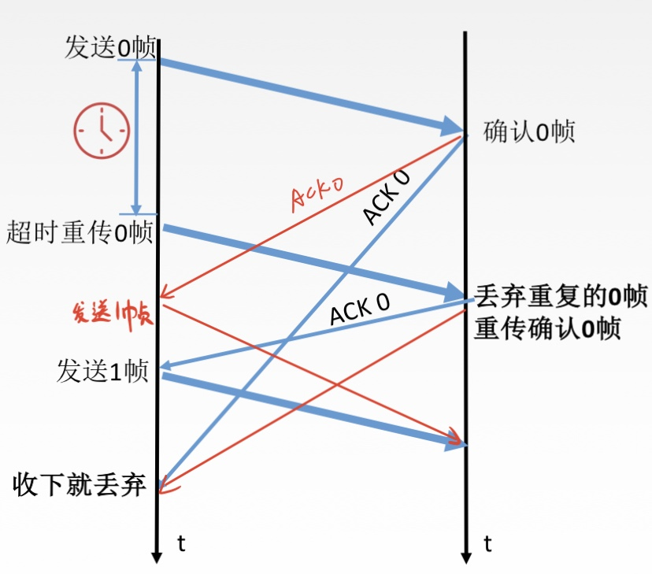

# 2. 数据链路层功能

数据链路层在物理层提供服务的基础上**向网络层提供服务**，其最基本的服务是将源自网络层来的数据**可靠**地传输到相邻节点的目标机网络层。

其主要作用是**加强物理层传输原始比特流的功能**，将物理层提供的可能出错的物理连接改造为**逻辑上无差错的数据链路**，使之对网络层表现为一条无差错的链路。

* **功能一：**为网络层提供服务。**无确认无连接服务**、**有确认无连接服务**、**有确认面向连接服务（有连接一定有确认）**。
* **功能二：**链路管理，即连接的建立、维持、释放（用于面向连接的服务）。
* **功能三：**组帧
* **功能四：**流量控制
* **功能五：**差错控制（帧错 / 位错）

## 1. 封装成帧 & 透明传输

### 1.1 封装成帧

**封装成帧（framing）**就是在一段数据的前后分别添加首部和尾部，这样就构成了一个帧。接收端在收到物理层上交的比特流后，就能根据首部和尾部的标记，从收到的比特流中识别出帧的开始和结束。

首部和尾部包含许多的控制信息，它们的一个重要作用：**帧定界**（确定帧的界限）。

**帧同步：接收方**应当能从接受到的二进制比特流中区分出帧的起始和终止。

**最大传送单元 MTU**（Maximum Transfer Unit）：规定帧的**数据部分的长度上限**

**组帧的四种方法：**1. 字符计数法，2. 字符（节）填充法，3. 零比特填充法，4. 违规编码法

### **1.2 透明传输**

**透明传输：**指不管所传数据是什么样的比特组合，都应当能够在链路上传送。因此，链路就 “看不见” 有什么妨碍数据传输的东西。

当所传数据中的比特组合恰巧与某一个控制信息完全一样时，就必须采取适当的措施，使接收方不会将这样的数据误认为是某种控制信息。这样才能保证数据链路层的传输是透明的。

### 1.3 组帧方法

#### 1. 字符计数法（不常用）

帧首部使用一个计数字段（第一个**字节**，八位）来标明帧内字符数。

**缺点：**如果第一个字节出现了错误，就会导致整个帧判断错误

#### 2. 字符填充法

帧的首部用 SOH（Start Of Header）表示，尾部用 EOT（End Of Transmission）表示。如图所示：

**使用情况：**

1.  当传送的帧是由文本文件组成时（文本文件的字符都是从键盘上输入的，都是 ASCII 码）。不管从键盘上输入什么字符都可以放在帧里传过去，即**透明传输**。
2.  当传送的帧是由非 ASCII 码的文本组成时（二进制代码的程序或图像等）。就要**采用字符填充方法实现透明传输**。
   * 当帧中出现控制字符 “SOH” 或 “EOT” 的前面插入一个**转义字符 “ESC”**（其十六进制编码是 1B，二进制是 0001 1011）
   * 在**接收端**的数据链路层在把数据送往网络层之前删除这个插入的转义字符
   * 如果转义字符也出现在数据部分中，解决方法是在转义字符前面插入一个转义字符

#### 3. 零比特填充法

在首部和尾部均用 0x7E（二进制：0111 1110）表示

**操作：**

1. 在发送端，扫描整个信息字段，只要连续 5 个 1，就立即填入 1 个 0

    

2. 在接收端收到一个帧时，先找到标志字段确定边界，再用硬件对比特流进行扫描。发现连续 5 个 1 时，就把后面的 0 删除。

    

**保证了透明传输：在传送的比特流中可以传送任意比特组合，而不会引起对帧边界的判断错误。**

#### 4. 违规编码法

曼彻斯特编码：  

由于曼彻斯特编码只会出现 **高-低**、**低-高** 的情况，所以我们可以使用 **高-高**，**底-底** 来定界帧的起始和终止。

**总结：**由于字节计数法中 Count 字段的脆弱性（其值若有差错将导致灾难性后果）及字符填充法实现上的复杂性和不兼容新，目前较普遍使用的帧同步是**比特填充**（零比特填充）和**违规编码法**。

## 2. 差错控制（检错编码）

### 2.1 差错从何而来？

概括的来说，传输中的差错都是由于**噪声引起**的。

* **（全局性）**由于线路本身电气特性所产生的的**随机噪声**（热噪声），是信道固有的，随机存在的。
  * **解决办法：**提高信噪比来减少或避免干扰。（对传感器下手）
* **（局部性）**外界特定的短暂原因所造成的**冲击噪声**，是产生差错的主要原因。
  * **解决办法：**通常利用编码技术来解决

差错的分类：

* **位错：**比特位出错，1 变为 0，0 变为 1
* **帧错：**
  * **帧丢失：**收到 \[\#1\]-\[\#3\]（丢失 \[\#2\]）
  * **帧重复：**收到 \[\#1\]-\[\#2\]-\[\#2\]-\[\#3\]（收到两个 \[\#2\]）
  * **帧失序：**收到 \[\#1\]-\[\#3\]-\[\#2\]

数据链路层为网络层提供服务：

* **无确认**无连接服务
  * 通信质量**好**的**有线**传输链路
  * 数据链路层**不**使用**确认**和**重传机制**，由上层传输层来解决
* **有确认**无连接服务、**有确认**面向连接服务
  * 通信质量**差**的**无线**传输链路
  * 数据链路层**使用确认**和**重传机制**

### 2.2 检错方法

差错控制（比特错）

* 检错编码
  * 奇偶校验码
  * 循环冗余码 CRC
* 纠错编码
  * 海明码

**冗余编码**

在数据发送前，先按照某种关系**附加**上一定的**冗余位**，构成一个符合某一规则的码字后再发送。当要发送的有效数据变化时，相应的冗余位也随之变化，使码字遵从不变的规则。接收端根据收到码字是否仍然符合原规则，从而判断是否出错。

**概念辨析：编码 VS 编码**

数据链路层编码和物理层的数据编码与调制**不同**。物理层编码针对的是**单个比特**，解决传输过程中比特的同步问题，如曼彻斯特编码。而数据链路层的编码针对的是**一组比特**，它通过冗余码的技术实现一组二进制比特串在传输过程是否出现了差错。

#### 方法一：奇偶校验码

奇偶校验码特点：只能检查出**奇数个比特错误**，检错能力为 50%

#### 方法二：CRC循环冗余码

1. 准备待传有效数据

    

2. 每组都加上冗余码构成帧再发送

    

   FCS 帧检验序列计算方式：

    

3. 接收方检验

    

例子：

**接收端检错过程：**把收到的每一个帧都除以同样的除数 P，然后检查得到的余数 R

* 若得到的余数 $$R = 0 $$ ，则判定这个帧没有差错，接受
* 若得到的余数 $$R \neq 0$$ ，则判定这个帧有差错，丢弃

FCS 的生成以及接收端 CRC 检验都是由**硬件**实现，处理很迅速，因此不会延误数据的传输。

在数据链路层若**仅仅**使用循环冗余检验 CRC 差错检测技术，只能做到对帧的**无差错接受**，即：**“凡是接收端数据链路层接受帧，我们就能非常接近于 1 的概率认为这些帧在传输过程中没有产生差错”**。

**可靠传输：**数据链路层发送端发送什么，接收端就收到什么。

数据链路层使用 CRC 检验，能够实现无比特差错传输，但这还不是可靠传输。

## 3. 差错控制（纠错编码）

### 3.1 基本概念

对于奇偶校验码，只能**发现错误**

而对于纠错编码——**海明码**，可以**发现错误**、**找到位置**、**纠正错误**

**海明码距**

两个合法编码（码字）的对应比特取值不同的比特数称为这两个码字的**海明距离（码距）**；

 只有一位不同，所以码距为 1

一个有效编码集中，任意两个合法编码（码字）的海明码距离的最小值称为该编码集的**海明距离（码距）**。

当码距为 n 时，可以检查出 n - 1 位的错误

**结论：**当需要检查出 d 为错误，需要码距为 d + 1；当需要纠正 d 为错误，需要码距为 2d + 1

### **3.2 工作流程**

1. 确定校验码位数 r

    

    

2. 确定校验码和数据的位置

    

3. 求出校验码的值

    

4. 检查并纠错

    

    

    

## 4. 差错控制知识脑图

## 5. 流量控制 & 可靠传输机制

### 5.1 流量控制概念

较高的发送速度和较低的接收能力的不匹配，会造成传输出错，因此流量控制也是数据链路层的一项重要工作。

**数据链路层和传输层流量控制的区别：**

* 数据链路层的流量控制是**点对点**的，而传输层的流量控制是**端到端**的
* **数据链路层**控制流量的手段：接收方收不下就不回复确认
* **传输层**流量控制的手段：接收端给发送端一个窗口公告

### 5.2 流量控制的方法

#### 1. 停止-等待协议

每发送完一个帧就停止发送，等待对方的确认，在收到确认后再发送下一个帧。

**缺点：**效率低

#### 2. 滑动窗口协议

其中包括：**后退 N 帧协议（GBN）**和**选择重传协议（SR）**

**运行机制：**如上图所示，发送窗口大小为 6，接收窗口大小为 1；发送窗口可以在未收到接收窗口确认的情况下依次发送窗口大小内的所有帧（0 - 5）；如果接收窗口发送了一个确认帧后，发送窗口会向后移动一格（1 - 6）。

**滑动窗口协议和停止 - 等待协议的联系：**停止 - 等待协议是特殊的滑动窗口协议（发送窗口为 1，接收窗口也为 1）

**窗口大小的对比：**

* 停止 - 等待协议：发送窗口大小 = 1，接收窗口大小 = 1
* 后退 N 帧协议（GBN）：发送窗口大小 &gt; 1，接收窗口大小 = 1
* 选择重传协议（SR）：发送窗口大小 &gt; 1，接收窗口大小 &gt; 1

**数据链路层和传输层滑动窗口的区别：**

* 数据链路层窗口的大小固定不能变
* 传输层窗口大小可变

### 5.3 比较 - 可靠传输 & 滑动窗口 & 流量控制

**可靠传输：**发送端发送啥，接收端就收到什么（如果帧出错，丢失等，需要重传）

**流量控制：**控制发送速率，使接收方有足够的缓冲空间来接收每一个帧

**滑动窗口解决：**

* 流量控制（收不下就不给确认，想发也发不了）
* 可靠传输（发送方自动重传）

### 5.4 知识脑图

## 6. 停止 - 等待协议

### 6.1 停止 - 等待协议的三个问题

1. 为什么会有停止等待协议？

   除了**比特出差错**，底层信道还会出现丢包问题。为了实现流量控制。

   **丢包：**物理路线故障、设备故障、病毒攻击、路由信息错误等原因，会导致数据包的丢失。

2. 研究停止等待协议的前提？

   虽然现在通常用全双工通信方式，但是为了讨论方便，仅考虑一方发送数据（发送方），一方接收数据（接收方）。

   因为是在讨论可靠传输的原理，所以并不考虑数据是在哪一层次上传输的。

   “停止等待”就是每发送完一个分组就停止发送，等待对方 确认，在收到确认后再发送下一个分组。

3. 停止等待协议有几种应用情况？

   无差错情况 & 有差错情况

### 6.2 无差错情况

上图的两个发送 0 帧，并不是代表同一帧，仅仅只是编号相同。

每发送 1 个数据帧就停止等待，因此用 1 bit 来编号就够。

### 6.3 有差错情况

#### 1. 数据帧丢失或检测到帧出错

**注意：**

1. 发完一个帧后，必须保留它的副本
2. 数据帧和确认帧必须编号

#### 2.  ACK 丢失

#### 3. ACK 迟到

          **OR**         

### 6.4 停止等待协议性能分析

**优点：**简单

**缺点：**信道利用率太低

**信道利用率：**  $$U = \frac {T_D} { T_D + RTT + T_A} \qquad$$ ，其中 $$T_D$$ 为数据帧发送时延， $$T_A$$ 为确认帧发送时延， $$RTT$$ 为往返时延

#### 信道利用率

信道利用率 = （L / C）/ T

* T 为发送周期（从开始发送数据，到收到第一个确认帧为止）
* L 为 T 时间内发送的比特数据大小
* C 为 发送方数据传输率

信道吞吐率 = 信道利用率 \* 发送方的发送速率

### 6.5 知识脑图

## 7. 后退 N 帧协议

### 7.1 滑动窗口

**累计确认：**当接收窗口接收了 0 - 2 三个帧，可以直接发送一个 2 号帧的确认ACK，就代表 2 号帧前面的所有帧都成功接收。

### 7.2 GBN 发送方必须响应的三件事

#### 1. 上层的调用

上层要发送数据时，发送方先检查发送窗口是否已满，如果**未满**，则产生一个帧并将其发送；如果**窗口已满**，发送方只需将数据返回给上层，暗示上层窗口已满。上层等一会再发送。（实际实现中，发送方可以缓存这些数据，窗口不满时再发送帧）。

#### 2. 收到了一个 ACK

GBN 协议中，对 n 号帧的确认采取**累计确认**的方式，标明接收方已经收到 n 号帧和它之前的全部帧。

#### 3. 超时事件

协议的名字为后退 N 帧 / 回退 N 帧，来源于出现丢失和时延过长帧时发送方的行为。就像在停等协议中一样，定时器将再次用于恢复数据帧或确认帧的的丢失。如果出现超时，发送方**重传所有已发送但未被确认的帧**。

### 7.3 GBN 接收方要做的事

如果正确收到 n 号帧，并且按序，那么接收方为 n 帧发送一个 ACK，并将该帧中的数据部分交付给上层。

其余情况都丢弃帧，并为最近按序接收的帧重新发送 ACK。接收方无需缓存任何失序帧，只需维护一个信息：expectedseqnum（下一个按序接收的帧序号）。

### 7.4 运行中的 GBN

### 7.5 滑动窗口的长度

窗口长度可以无限吗？（不可以）

若采用 n 个比特对帧编号，那么发送窗口的尺寸 $$W_T$$ 应满足： $$1 \le W_T \le 2^n - 1$$ 。因为发送窗口尺寸过大，就会使得接收方**无法区别新帧和旧帧**。

### 7.6 重点内容总结

1. 累计确认（偶尔捎带确认）

   **捎带确认：**有时接收方也会发送数据给发送方，所以可以把确认帧直接包含在数据里一起发送。

2. 接收方只按序接受帧，不按序则丢弃
3. 确认序列号最大的、按序到达的帧
4. 发送窗口最大为 $$2^n - 1$$ ，接收窗口大小为 1

**例题：**

### 7.7 GNB 协议性能分析

**good：**因连续发送数据而提高了信道利用率

**bad：**在重传时必须把原来已经正确传送的数据帧重传，使传送效率降低

### 7.8 知识脑图

## 8. 选择重传协议（Selective Repeat）

### 8.1 GBN 协议的弊端

因为**累计确认**机制，导致如果中途有一帧发送失败，需要**重传其后的所有帧**。

**思考：**可不可以只重传出错的帧？

**解决办法：**设置单个确认，同时加大接收窗口，设置接收缓存，缓存乱序到达的帧。

### 8.2 滑动窗口

### 8.3 SR 发送方必须响应的三件事

#### 1. 上层的调用

从上层收到数据后，SR 发送方检查下一个可用于该帧的序号，如果序号位于发送窗口内，则发送数据帧；就像 GBN 一样，要么将数据**缓存**，要么**返回给上层**之后再传输。

#### 2. 收到了一个 ACK

如果收到 ACK，且该帧序号在窗口内，则 SR 发送方将那个被确认的帧标记为已接收。如果该帧序号是窗口的下界（最左边第一个窗口对应的序号），则窗口向前移动到具有最小序列的未确认帧处。如果窗口移动了并且有序号在窗口内的未发送帧，则发送这些帧。

#### 3. 超时事件

每个帧都有自己的定时器，一个超时事件发生后**只重传一个帧**。

### 8.4 SR 接收方要做的事

**来者不拒（窗口内的帧）**

SR 接收方将**确认一个正确接收的帧**而**不管其是否按序**。失序的帧将被**缓存**，并返回给发送方一个该帧的确认帧**【收谁确认谁】**，直到所有帧（即序号更小的帧）皆被收到为止，这是才可以将一批帧按序交付给上层，然后**向前移动滑动窗口**。

如果收到了窗口序号外（小于窗口下界）的帧，就返回一个 ACK。其他情况，就忽略该帧。

### 8.5 运行中的 SR

### 8.6 滑动窗口长度

窗口长度可以无限吗？（不可以）

**上述图片的现象：** 和帧的编号相比，窗口的大小过大，导致可能出现分不清是重传帧还是新帧的情况。

**设计原则：**发送窗口最好等于接收窗口。（大了会溢出，下了没意义） $$W_{Tmax} = W_{Rmax} = 2^{n - 1}$$ 

### 8.7 重点内容分析

1. 对数据帧逐一确认，收一个确认一个
2. 只重传出错帧
3. 接收方有缓存
4. $$W_{Tmax} = W_{Rmax} = 2^{n - 1}$$ ，其中 n 为比特大小

**例题：**

### 8.8 知识脑图

