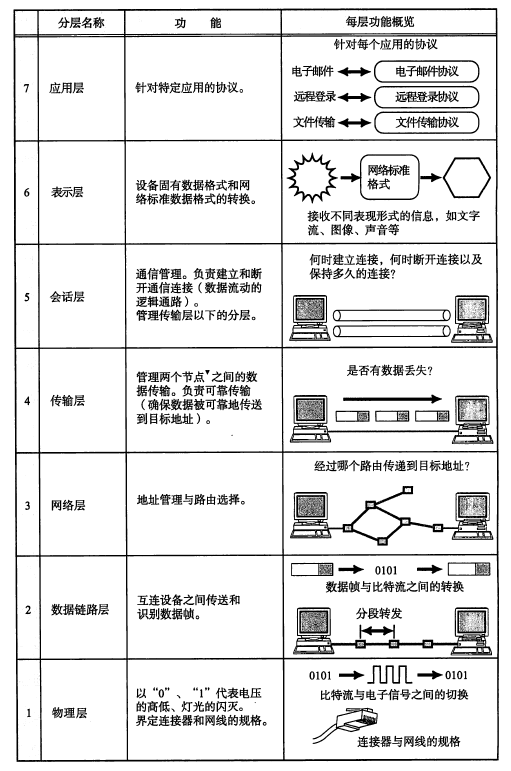

# 第一章：网络基础知识

## 1. 计算机网络出现的背景

### 从独立模式到网络互连模式

**独立模式：**单计算机模式，每个计算机都拥有自己的客户数据，互相独立。

每个计算机只能处理一个业务，用户根据自己要处理的业务选择相应计算机。

**网络互连模式：**多台计算机之间相互连接，共享数据由远端服务器集中管理。

### 从计算机通信到信息通信

由最初的少数几台电脑互连，到有共同业务往来的机构互连，如同一公司、同一实验室等，形成一种**私有网络**。

随着发展，人们将多个私有网络相连形成更大的网络，最后发展成了任何一台计算机都互连，形成了互联网。

## 2. 计算机与网络发展的7个阶段

### 批处理

批处理之前，人们都是输入一行命令，计算机执行一条执行，命令行模式。

批处理就是事先将用户的程序和数据装入卡带和磁带，计算机按照一定的顺序读取命令。

**缺点：**

1. 操作复杂，只有专门的操作员才会操作
2. 处理时间长，一般不能立即得到结果

### 分时系统

多个终端与一个计算机相连，允许多个用户同时使用一台计算机的系统。

分时系统实现了 “一人一机” 的目的，让用户感觉就像 “完全是自己在使用一台计算机一样”，体现了分时系统的**独占性**。

### 计算机之间的通信

分时系统虽然是多个终端和一个计算机相连，但是这并不意味着计算机与计算机之间也是相互连接的。

在计算机间的通信技术诞生之前，如果想让一台计算机中的数据传到另一台计算机，比较繁琐，需要用到外部存储媒介，如磁带、软盘。

计算机之间通信让人们处理业务从一台计算机到多台计算机分布式处理，这大大加快了处理的效率和速度。

### 计算机网络的诞生

### 互联网的普及

### 以互联网技术为中心的时代

### 从“单纯建立连接”到“安全建立连接”

## 3. 协议

### 协议的必要性

协议是计算机与计算机之间事先达成的一种“约定”，这种“约定”让不同厂商，不同CPU以及不同操作系统组成的计算机之间，只要遵循这种协议就可以进行通信。

### 协议如同人与人的对话

**例子：**有三个人A、B、C。A只会说汉语、B只会说英语、而C既会说汉语又会说英语。

* 将汉语和英语当作“协议”
* 将聊天当作“通信”
* 将说话的内容当作“数据”

A和B无法交流，因为他们的语言不同，对方都听不懂；A和B都可以和C交流，因为C同时会汉语和英语

计算机也是如此，只有拥有相同的协议，才可以顺利的进行通信

### 计算机中的协议

人类具有理解能力，对于一些比较模糊的话，或者语法有误的话，还是可以理解意思；但是计算机没有。

所以计算机的各个组件必须严格的按照协议规定，才可以顺利通信。

### 分组交换协议

分组交换是指将一个大数据分割成一个个叫做包的较小单位进行传输的方法，目标主机再将这些小的单位按照顺序拼接起来。

每一个包都有一个首部，用来存放该包的信息，通信的时候可以根据报文首部来进行正确通信。

## 4. 协议由谁规定

最初，每个厂商都有自己的网络体系结构和协议，且不相互兼容，所以导致一个问题，只有相同厂商的产品才可以相互通信，这样带来了极大的不便。

为了解决上述问题，ISO 制定了一个国际标准 OSI，对通信系统进行了标准化。

**注：TCP/IP 是由 IETF 所建议的、致力于推进其标准化作业的一种协议。**

## 5. 协议分层与OSI参考模型

### 协议的分层

每个分层都接收由它下一层所提供的的特定服务，并且负责为自己上一层提供特定的服务。

上下层之间交互的叫做 “接口”，同一层之间交互的叫做 “协议”

### 通过对话理解分层

**前提条件：**

* A 和 C 对话
* 只考虑 **语言层** 和 **通信设备层**

**数据传输过程：**

1. 声音先从 A 口中说出，传入电话机中
2. 在通信设备层 声音 转换为 电波信号，传到另一方的电话机中
3. 另一方的电话机识别到电波信号，重新转化为 声音，传入 C 的耳中

### OSI 参考模型

OSI 参考模型将这样一个复杂的协议整理并分为了易于理解的7个层次。

不过，OSI 参考模型终究是一个 “模型”，它只是对各层的作用做了一系列粗略的界定，并没有对协议和接口进行详细的定义。

### OSI 参考模型中各个分层的作用

* **应用层**

  **为应用程序提供服务**并**规定应用程序中通信相关的细节**。包括文件传输、电子邮件、远程登录（虚拟终端）等协议

* **表示层**

  将应用处理的信息转换成为合适网络传输的格式，或将来自下一层的数据转换为上层能够处理的格式。因此它主要负责数据格式的转换。

  具体来说，就是将设备固有的数据格式转化为网络标准传输格式。不同设备对同一比特流解释的结果可能会不一样。因此，使它们保持一致是这一层主要的作用。

* **会话层**

  负责建立和断开通信连接（数据流动的逻辑通路），以及数据的分割等数据传输相关的管理。

* **传输层**

  起着可靠传输的作用。只在**通信双方节点**上进行处理，而无需在路由器上处理。

  通信双方节点：互连的网络中断，如计算机等设备。

* **网络层**

  将数据传输到目标地址。目标地址可以是多个网络通过路由器连接而成的某一个地址。因此这一层主要负责**寻址**和**路由选择**。

* **数据链路层**

  负责物理层面上互连的，节点之间的通信传输。

  将 0、1序列划分为具有意义的数据帧传送给对端（数据帧的生成和接收）。

* **物理层**

  负责 0、1比特流（0、1 序列）与电压高低、光的闪灭之间的互换。

## 6. OSI 参考模型通信处理举例

假设使用主机 A 的用户 A 要给使用主机 B 的用户 B 发送一封电子邮件。

### 7 层通信

发送方从第 7 层、第 6 层到第 1 层由上至下按顺序传输数据，而接收端则从第 1 层、第 2 层到第 7 层由下至上向每个上一级分层传输数据。

每个分层上，在处理由上一层传过来的数据时 可以附上当前分层的协议所必须的 “首部” 信息。

然后接收端对收到的数据进行 数据 “首部” 与 “内容” 的分离，再转发给上一分层，并最终将发送端的数据恢复为原状。

### 会话层以上的处理

* **应用层**

  对于应用层来说，具体有两个功能，其一：**为应用程序提供服务**；其二：**规定通信的细节**。

  在发送邮件的例子中，**为应用程序提供的服务**是**输入电子邮件的内容**，**规定通信的细节**是**指定发送的目标地址**。

  同时，应用层可能还需要拥有处理错误情况的功能，比如邮件发送失败等。

* **表示**

  **功能：**“某个计算机特定的数据格式” 和 “网络通用的标准数据格式” 的相互转换。

* **会话层**

  只对**何时**建立连接、**何时**发送数据等问题进行管理。

### 传输层以下的处理

* **传输层**

  **功能：**建立连接、断开连接，在两个主机间创建逻辑上的通信连接是传输层的主要作用

  同时，传输层为**确保**所传输的数据到达目标地址**（可靠传输）**

* **网络层**

  **功能：**将数据从发送端主机发送到接收端主机**（根据目标地址）**

  **传输层和网络层的关系：**

  * 网络层不能保证数据的可达性，有时也会出现数据丢失、顺序混乱等问题
  * 传输层负责 正确的传输数据的处理
  * 所以两者互相协作以确保数据包可以送到世界各地，实现可靠传输

* **数据链路层**

  根据 **MAC 地址**识别设备

* **物理层**

  将数据的 0、1 转换为电压和脉冲光传输在物理介质上

## 7. 传输方式的分类

### 面向有连接型与面向无连接型

#### 面向有连接型

* 在发送数据前，需要在收发主机之间连接一条通信路线。在通信传输前后，需要专门进行**建立和断开**连接的处理。
* 例如，打电话，需要双方都接通，才可以进行真正的通话

**面向无连接型**

* 不要求建立和断开和建立连接，发送端可于任何时候自由的发送数据。
* 接收端不知道自己何时会受到数据，所以接收端需要时常确认是否会收到了数据

### 电路交换与分组交换

**电路交换**

* 源主机需要通过**交换机**与目标主机之间建立通信电路
* 用户可以一直使用连接的电路，直到连接被断开为止
* 缺点：**独占性**（导致其他计算机无法通信，必须等到当前通信结束后才可以通信）

**分组交换**

* 将一个完整的数据分成多个小的分组，每个小的分组的首部都包含目标源地址和目标地址信息，这样可以保证每个分组可以正确的达到目标主机
* 计算机和路由器之间以及路由器和路由器之间通常只有一条通信路线
* 对于电路交换，传输速度不变；对于分组交换，通信路线的速度可能会有所不同，根据网络的拥堵情况，数据到达目标地址的时间有长有短
* 可能因为路由器的缓存饱和或溢出时，可能出现分组数据丢失，无法成功发送到目标地址的情况

#### 电路交换和分组交换的区别

### 根据接收端数量分类

## 8. 地址

通信传输中，发送端和接收端可以被视为通信主体，它们都有一个 **地址** 信息加以标识。如同人们打电话，手机号就相当于地址。

在计算机通信中，地址不仅仅代表 IP 地址，同时 MAC地址、端口号 等信息都可以被作为地址标识。

#### 地址的唯一性

#### 地址的层次性

类比于手机号，也是有层次性的。包括国家区号、国内区号。

通信地址也有层次性。包含国名、省名、市名和区名等

在 MAC地址 和 IP 地址都有唯一性，但是只有 IP地址具有层次性。

MAC地址由设备制造商在计算机生产时，对每块网卡进行分别指定。

IP地址 分为 网络号和主机号

**路由控制表**

* IP寻址所参考的表

**地址转发表**

* MAC寻址所参考的表

## 9. 网络的构成要素

### 通信媒介与数据链路

#### 数据链路

* 计算机之间通过**电缆**互相连接
* 电缆可以分为很多种，包括：双绞线电缆、光纤电缆、同轴电缆、串行电缆等。根据数据链路的不同选用不同的电缆

**媒介**

* 媒介可以划分为电波、微波等不同类型的电磁波

**传输速率**

* 两个设备之间数据流动的物理速度（单位时间内传输的**数据量**）
* 又称作 带宽（Bandwidth）
* 单位 bps（Bits Per Second，每秒比特数）

**吞吐量**

* 主机之间**实际的**传输速率

### 网卡

任何一台计算机连接网络时，必须要使用网卡（网络接口卡 NIC），也被叫做网络适配器，网卡，LAN卡。

一块网卡包括了 OSI 模型的两个层，**物理层和数据链路层**，其主要作用为：

* 将电脑的数据封装成帧，并通过网线（对于无线网来说就是电磁波）将数据发送到网络上去
* 接收网络上其它设备传过来的帧，并将帧重新组合成数据，发送到电脑中

### 中继器

中继器是在 OSI 模型的第一层（物理层）上 **延长网络** 的设备。由电缆传过来的电信号或光信号经由中继器的波形**调整**和**放大**再传给另一个电缆。

**特点：**

* 中继器是对减弱信号进行放大和发送的设备
* 中继器通过物理层的连接延长网络
* 即使在数据链路层出现某些错误，中继器仍然转发数据（不负责判断数据是否有错误）
* 中继器无法改变传输速度（不能在传输速度不同的媒介之间转发）

**注意：**通过中继器可以进行网络延长，但是也并非可以无限扩大。一个 10Mbps 的以太网最多可以用 4 个中继器分段连接；而一个 100Mbps 的以太网最多只能用 2 个中继器。

有些中继器可以提供多个端口服务，这种中继器称作 **中继集线器** 或 **集线器（Hub）**

### 网桥 / 2 层交换机

网桥是在 OSI 模型的第二层（数据链路层）上 **连接两个网络** 的设备。它能够识别数据链路层中的数据帧，并将这些数据帧临时存储于内存中，再生成信号作为一个全新的帧转发给相连的另一个网段（**根据 MAC 地址）**。

**特点：**

* 网桥根据数据帧的内容转发数据给相邻的其他网络
* 网桥没有连接网段个数的限制
* 网桥基本上只用于连接相同类型的网络；但是有时也可以连接传输速率不同的网络
* 网桥可以校验数据的正确性（通过数据帧中的一个数据位：FCS；用 CRC 来检查数据帧是否正确）
* 网桥具有自学机制，通过自己转发过的数据帧的MAC地址，判断是否需要向某个网段转发数据帧
* 网桥具有过滤功能控制网络流量

**自学式网桥过程：**

1. 主机 A 向主机 B 发送数据帧
2. 网桥学习到主机 A 属于网络 A
3. 由于网桥尚不知主机 B 属于哪个网络，暂时将数据帧转发给网络 B
4. 主机 B 向主机 A 发送数据帧
5. 由于网桥此时已经知道主机 A 属于网络 A，不再将应发往主机 A 的数据帧转发给网络 B。并且它也学习到主机 B 属于网络 A
6. 此后，当主机 A 再发送数据帧给主机 B 时，只在网络 A 中传送

现在 **交换集线器（Hub）**也属于网桥的一种，交换集线器中连接电缆的每个端口都能提供类似网桥的功能。

### 路由器 / 3 层交换机

路由器是在 OSI 模型的第三层（网络层）上 **连接两个网络、并对分组报文进行转发** 的设备。网桥是根据**物理地址（MAC地址）**进行转发，而路由器则是根据 **IP 地址**进行处理的。

**特点：**

* 路由器是连接网络与网络的设备
* 可以将分组报文发送给另一个目标路由器地址
* 基本上可以连接任意两个数据链路
* 路由器有分担网络负荷的作用

### 网关

网关是 OSI 参考模型中负责将从传输层到应用层的数据进行**转换**和**转发**的设备。

应用：在两个不能进行直接通信的协议之间进行翻译，最终实现两者之间的通信。

